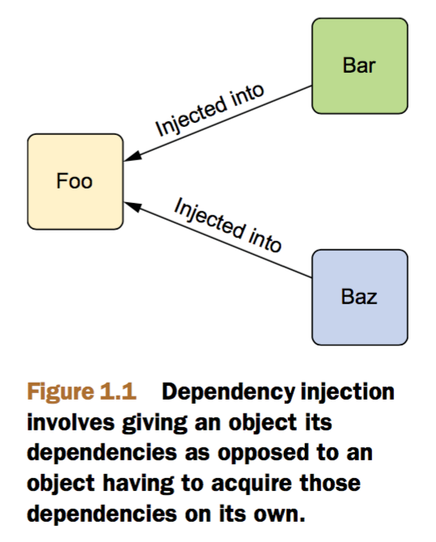
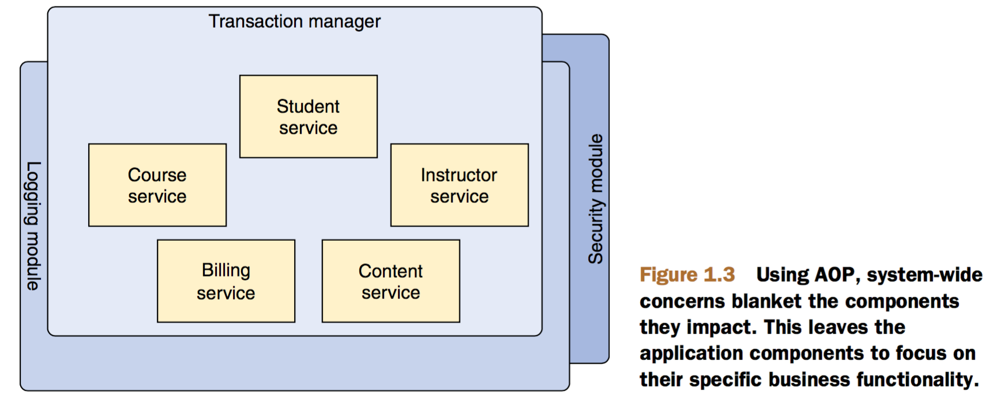
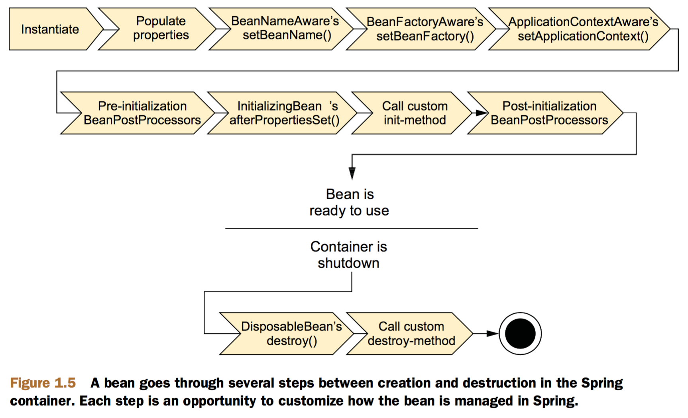

# 1 Springing into action

## 1.1 简化Java开发

Spring主要通过下面4种关键策略来简化Java开发：

* 使用POJOs最小侵入性开发
* 通过DI和面向接口编程实现松耦合
* 通过切面和约定实现声明式编程
* 通过切面和模板消除样板代码

**POJOs**

POJO（Plan Old Java Object）即普通的Java对象，许多框架需要你继承它们的类或者实现它们的接口来使用，而Spring则尽可能避免让你的代码和它的API混在一起，顶多使用Spring注解，但类其实还是POJO。

**DI**

DI（Dependency Injection）即依赖注入，稍微复杂点的应用都至少包含两个以上互相协作的类，传统上，每个对象自己负责获取它需要的对象的引用（它的依赖），这就导致了紧耦合和难测试的代码。

看下面这个Knight类：

```
package com.springinaction.knights;

public class DamselRescuingKnight implements Knight {

  private RescueDamselQuest quest;
  
  public DamselRescuingKnight() {
    this.quest = new RescueDamselQuest();
  }
  
  public void embarkOnQuest() {
    quest.embark();
  }
}
```

DamselRescuingKnight在构造器中自己创建了一个RescueDamselQuest，如果想换个quest，就不好办了，而且也难测试。

使用依赖注入，依赖由系统中的第三方在对象创建的时候注入进去，如下图所示：



看下面的BraveKnight类：

```
package com.springinaction.knights;

public class BraveKnight implements Knight {
  
  private Quest quest;
  
  public BraveKnight(Quest quest) {
    this.quest = quest;
  }
  
  public void embarkOnQuest() {
    quest.embark();
  }
}
```

BraveKnight不自己创建quest，而是在构造时通过参数传进来，即构造器注入。而且Quest是一个接口，所以可以传任意的实现进来，BraveKnight不与任何特定的Quest实现耦合，这就是DI的松耦合，BraveKnight什么都不用管，就可以轻松换一种Quest实现，这样就可以使用Mock对象来测试了：

```
package com.springinaction.knights;
import static org.mockito.Mockito.*;
import org.junit.Test;

public class BraveKnightTest {

  @Test
  public void knightShouldEmbarkOnQuest() {
    Quest mockQuest = mock(Quest.class);
    BraveKnight knight = new BraveKnight(mockQuest);
    knight.embarkOnQuest();
    verify(mockQuest, times(1)).embark();
  }
}
```

Mock测试框架Mockito创建了一个Quest接口的mock实现，注入到BraveKnight实例中，在调用了embarkOnQuest()方法之后，请求Mockito来验证Quest对象的embark()方法被恰好调用了一次。

现在我们要把Quest实现注入到BraveKnight中去了，下面是一个Quest实现：

```
package com.springinaction.knights;

import java.io.PrintStream;

public class SlayDragonQuest implements Quest {
  
  private PrintStream stream;
  
  public SlayDragonQuest(PrintStream stream) {
    this.stream = stream;
  }
  
  public void embark() {
    stream.println("Embarking on quest to slay the dragon!");
  }
}
```

在Spring中，这种建立应用组件之间关系的操作叫做wiring（装配），有好多种方法可以实现装配，通常使用XML。下面是一个简单的Spring配置文件knights.xml，把一个BraveKnight，一个SlayDragonQuest和一个PrintStream装配到一起：

```
<?xml version="1.0" encoding="UTF-8"?>
<beans xmlns="http://www.springframework.org/schema/beans"
  xmlns:xsi="http://www.w3.org/2001/XMLSchema-instance"
  xsi:schemaLocation="http://www.springframework.org/schema/beans
      http://www.springframework.org/schema/beans/spring-beans.xsd">
  
  <bean id="knight" class="com.springinaction.knights.BraveKnight">
    <constructor-arg ref="quest" />
  </bean>
  
  <bean id="quest" class="com.springinaction.knights.SlayDragonQuest">
    <constructor-arg value="#{T(System).out}" />
  </bean>
</beans>
```

BraveKnight和SlayDragonQuest被声明为bean，SlayDragonQuest bean使用Spring表达式语言来传递System.out（一个PrintStream）给它的构造器。

如果你不想使用XML，也可以使用Java配置：

```
package com.springinaction.knights.config;

import org.springframework.context.annotation.Bean;
import org.springframework.context.annotation.Configuration;

import com.springinaction.knights.BraveKnight;
import com.springinaction.knights.Knight;
import com.springinaction.knights.Quest;
import com.springinaction.knights.SlayDragonQuest;

@Configuration
public class KnightConfig {

  @Bean
  public Knight knight() {
    return new BraveKnight(quest());
  }
  
  @Bean
  public Quest quest() {
    return new SlayDragonQuest(System.out);
  }
}
```

现在你已经定义好bean和它们之间的关系了，你需要加载XML配置文件来启动应用。

在Spring应用中，一个application context（应用上下文）全权负责加载bean定义以及把它们装配起来。Spring提供了几种应用上下文的实现，差别主要在于如何加载配置。

如果是定义在XML文件中的配置，ClassPathXmlApplicationContext会是一个合适的选择，它会从应用类路径下的一个或多个XML文件加载Spring上下文，对于基于Java的配置，Spring提供了AnnotationConfigApplicationContext，下面是KnightMain例子：

```
package com.springinaction.knights;

import org.springframework.context.support.ClassPathXmlApplicationContext;

public class KnightMain {

  public static void main(String[] args) throws Exception {
    ClassPathXmlApplicationContext context = new ClassPathXmlApplicationContext(
        "META-INF/spring/knight.xml");
    Knight knight = context.getBean(Knight.class);
    knight.embarkOnQuest();
    context.close();
  }
}
```

**使用切面**

AOP（Aspect Oriented Programming）即面向切面编程。一个应用通常有很多业务模块，这些业务模块有自己的核心功能，也有像日志、权限和事务管理这种跨多模块的公用服务，把这些公用服务从业务模块中剥离出来，形成切面，可以使业务模块专注自己的业务逻辑，这些切面也可以声明式地应用到业务模块上，如图所示：



假设有下面一个Minstrel类（吟游诗人）：

```
package com.springinaction.knights;

import java.io.PrintStream;

public class Minstrel {

  private PrintStream stream;
  
  public Minstrel(PrintStream stream) {
    this.stream = stream;
  }
  
  public void singBeforeQuest() {
    stream.println("Fa la la, the knight is so brave!");
  }
  
  public void singAfterQuest() {
    stream.println("Tee hee hee, the brave knight " +
        "did embark on a quest!");
  }
}
```

有两个方法，分别会在quest之前和之后调用：

```
package com.springinaction.knights;

public class BraveKnight implements Knight {

  private Quest quest;
  private Minstrel minstrel;
  
  public BraveKnight(Quest quest, Minstrel minstrel) {
    this.quest = quest;
    this.minstrel = minstrel;
  }

  public void embarkOnQuest() throws QuestException {
    minstrel.singBeforeQuest();
    quest.embark();
    minstrel.singAfterQuest();
  }
}
```

但是，knight真的需要管理minstrel吗，knight和minstrel只要自己管好自己就可以了，就好像观众会在演员开始表演之前和表演结束后鼓掌，演员只管自己演出，用不着操心观众，所以，需要把Minstrel变成一个切面，在Spring配置文件中声明一下：

```
<?xml version="1.0" encoding="UTF-8"?>>
<beans xmlns="http://www.springframework.org/schema/beans"
  xmlns:xsi="http://www.w3.org/2001/XMLSchema-instance"
  xmlns:aop="http://www.springframework.org/schema/aop"
  xsi:schemaLocation="http://www.springframework.org/schema/aop
      http://www.springframework.org/schema/aop/spring-aop-3.2.xsd
      http://www.springframework.org/schema/beans
      http://www.springframework.org/schema/beans/spring-beans.xsd">
  
  <bean id="knight" class="com.springinaction.knights.BraveKnight">
    <constructor-arg ref="quest" />
  </bean>
  
  <bean id="quest" class="com.springinaction.knights.SlayDragonQuest">
    <constructor-arg value="#{T(System).out}" />
  </bean>
  
  <bean id="minstrel" class="com.springinaction.knights.Minstrel">
    <constructor-arg value="#{T(System).out}" />
  </bean>
  
  <aop:config>
    <aop:aspect ref="minstrel">
      <aop:pointcut id="embark" expression="execution(* *.embarkOnQuest(..))"/>
      <aop:before pointcut-ref="embark" method="singBeforeQuest"/>
      <aop:after pointcut-ref="embark" method="singAfterQuest"/>
    </aop:aspect>
  </aop:config>

</beans>
```

**消除样板代码**

Java API里充满了各种各样的样板代码，比如使用JDBC：

```
public Employee getEmployeeById(long id) {
  Connection conn = null;
  PreparedStatement stmt = null;
  ResultSet rs = null;
  try {
    conn = dataSource.getConnection();
    stmt = conn.prepareStatement(
        "select id, firstname, lastname, salary from " +
        "employee where id=?");
    stmt.setLong(1, id);
    rs = stmt.executeQuery();
    Employee employee = null;
    if (rs.next()) {
      employee = new Employee();
      employee.setId(rs.getLong("id"));
      employee.setFirstName(rs.getString("firstname"));
      employee.setLastName(rs.getString("lastname"));
      employee.setSalary(rs.getBigDecimal("salary"));
    }
    return employee;
  } catch (SQLException e) {
  } finally {
    if (rs != null) {
      try {
        rs.close();
      } catch (SQLException e) {}
    }
    if (stmt != null) {
      try {
        stmt.close();
      } catch (SQLException e) {}
    }
    if (conn != null) {
      try {
        conn.close();
      } catch (SQLException e) {}
    }
  }
  return null;
}
```

就用JDBC查一个员工的信息，真正的代码就几行，大部分都是无聊的样板代码。Spring使用模板来消除样板代码，如JdbcTemplate：

```
public Employee getEmployeeById(long id) {
  return jdbcTemplate.queryForObject(
      "select id, firstname, lastname, salary from employee where id=?",
      new RowMapper<Employee>() {
        public Employee mapRow(ResultSet rs, int rowNum) throws SQLException {
          Employee employee = new Employee();
          employee.setId(rs.getLong("id"));
          employee.setFirstName(rs.getString("firstname"));
          employee.setLastName(rs.getString("lastname"));
          employee.setSalary(rs.getBigDecimal("salary"));
          return employee;
        }
      }, id);
}
```

## 1.2 容纳你的beans

在Spring应用中，对象在Spring容器中生存，容器是Spring的核心，Spring提供了几种容器实现，分为两大类：*Bean工厂*（由org.springframework.beans.factory.BeanFactory接口定义）是最简单的容器，提供DI的基本支持，*应用上下文*（由org.springframework.context.ApplicationContext接口定义）建立在Bean工厂的概念之上，提供了应用框架服务，如从属性文件解析文本消息和向事件监听器发布应用事件。由于Bean工厂对于大多数应用来说过于底层了，所以更推荐用应用上下文。

Spring提供了几种应用上下文：

* AnnotationConfigApplicationContext——从一个或多个Java配置类加载Spring应用上下文
* AnnotationConfigWebApplicationContext——从一个或多个Java配置类加载Spring Web应用上下文
* ClassPathXmlApplicationContext——从类路径下的一个或多个XML配置文件加载Spring应用上下文
* FileSystemXmlApplicationContext——从文件系统下的一个或多个XML配置文件加载Spring应用上下文
* XmlWebApplicationContext——从一个web应用的的一个或多个XML配置文件加载Spring应用上下文

例子：

```
ApplicationContext context = new FileSystemXmlApplicationContext("c:/knight.xml");
ApplicationContext context = new ClassPathXmlApplicationContext("knight.xml");
ApplicationContext context = new AnnotationConfigApplicationContext(com.springinaction.knights.config.KnightConfig.class);
```

**Bean的生命周期**



如上图，bean在可用之前经过几个步骤：

1. Spring实例化bean
2. Spring向bean的属性注入值和bean引用
3. 如果bean实现了BeanNameAware，Spring传递bean的ID给setBeanName方法
4. 如果bean实现了BeanFactoryAware，Spring调用setBeanFactory()方法，传入bean工厂自身
5. 如果bean实现了ApplicationContextAware，Spring调用setApplicationContext()方法，传入包含bean的应用上下文
6. 如果bean实现了BeanPostProcessor接口，Spring调用它的postProcessBeforeInitialization()方法
7. 如果bean实现了InitializingBean接口，Spring调用它的afterPropertiesSet()方法，类似的，如果bean声明了一个init方法，指定的初始化方法会被调用
8. 如果bean实现了BeanPostProcessor，Spring调用它的postProcessAfterInitialization()方法
9. 到这里，bean已经可以使用了，且一直留在应用上下文中，直到应用上下文被销毁
10. 如果bean实现了DisposableBean接口，Spring调用它的destroy()方法，同样的，如果bean声明了一个destroy方法，指定的方法会被调用。

## 1.3 Spring纵览

超越Spring框架本身的，是一个建立在核心框架之上的更大的生态系统，比如web services、REST、mobile和NoSQL领域。

**Spring模块**


